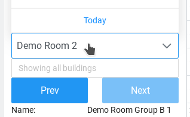

# Bugs

## Home page
| Home Page | home.component.ts | `https://localhost:5001/home` |
| ------------ | ------------- | ------------ |

- Room Drop Down
- When click on ('Demo Room Group B 1' room (the 8th room) in the second page / room on the next page)

## Edit bookings forms 

- New booking form (click on a green field on home page)

| Room settings form | edit-bookings.component.html | `https://localhost:5001/home` |
| ------------ | ------------- | ------------ |

"mark as closed" should not be shown when a user doesn't have `facility management` permission
get from `permissions.service.ts` when in front end

## Rooms 

| Room settings form | room-settings.component.ts | `https://localhost:5001/GlobalList/Rooms` |
| ------------ | ------------- | ------------ |

- The field below `In Advance Day` are custom fields, currently is the data can be loaded but cannot be saved. fix the saving function